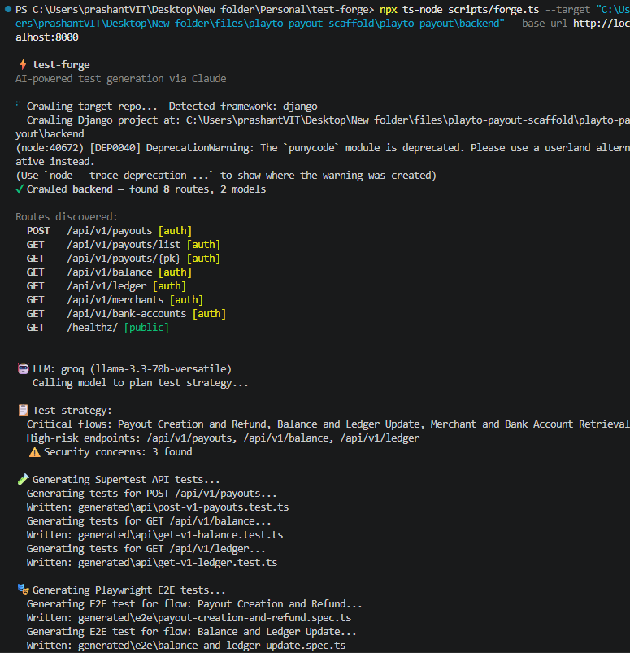
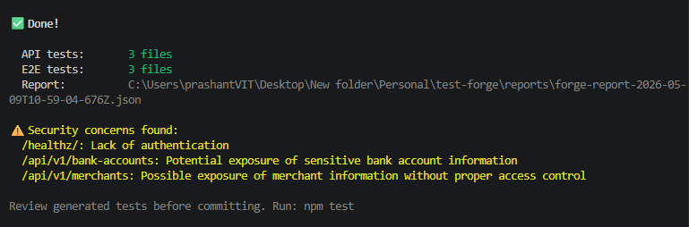
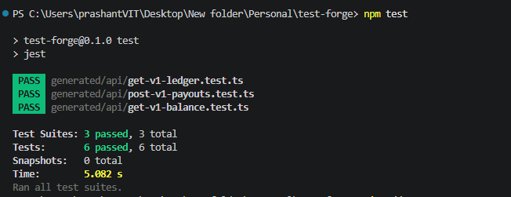

# test-forge

`test-forge` is an AI-assisted test harness for backend projects. It inspects a target codebase, extracts the API surface, asks an LLM to plan meaningful coverage, and writes runnable test files for both API-level and flow-level validation.

The project is designed to help us go from "here is a backend repo" to "here are generated tests and a structured report" with as little manual wiring as possible.

## What It Does

- Detects the backend framework from the target repository
- Crawls routes and basic model information
- Builds an internal API map from the discovered code
- Uses Groq in development or Anthropic in production to plan test strategy
- Generates:
  - `Supertest` API tests in `generated/api`
  - `Playwright` E2E-style request flows in `generated/e2e`
- Writes a machine-readable generation report in `reports`

## Current Framework Support

- `django`
- `express`
- `fastapi`
- `auto` detection through the CLI

## Why This Exists

Backend teams often have one of these problems:

- the API exists, but regression coverage is thin
- onboarding engineers do not know the most important flows yet
- there is no quick way to bootstrap tests for an unfamiliar repo
- PR quality checks depend too much on manual review

`test-forge` helps by generating a first pass of useful tests from the actual codebase shape, then leaving the final review and refinement to engineers.

## Project Layout

```text
test-forge/
|-- generated/               # Generated test output
|   |-- api/                 # Jest + Supertest suites
|   `-- e2e/                 # Playwright suites
|-- reports/                 # JSON reports from each forge run
|-- scripts/
|   `-- forge.ts             # CLI entrypoint
|-- src/
|   |-- crawler/             # Framework-aware repo analysis
|   `-- generator/           # Test planning + file generation
|-- .env.example
|-- package.json
`-- README.md
```

## How The Flow Works

1. You point `test-forge` at a backend repo.
2. The crawler inspects framework files such as route definitions, views, and models.
3. The generator creates an API map with routes, tags, auth assumptions, and model hints.
4. An LLM proposes:
   - critical end-to-end flows
   - high-risk endpoints
   - obvious security concerns
5. `test-forge` writes API tests and E2E flow tests to disk.
6. The generated tests can then be run locally or in CI.

## Installation

```bash
npm install
```

## Environment Setup

Create a local `.env` file from the example:

```bash
cp .env.example .env
```

Important environment variables:

- `NODE_ENV=development`
  Uses Groq for cheaper, faster development-time generation
- `NODE_ENV=production`
  Uses Anthropic for higher quality generation
- `GROQ_API_KEY`
  Required when running in development mode
- `ANTHROPIC_API_KEY`
  Required when running in production mode
- `TARGET_BASE_URL`
  Base URL for the running backend under test
- `FORGE_MERCHANT_UUID`
  Deterministic fixture merchant for generated Django payout tests
- `FORGE_BANK_ACCOUNT_UUID`
  Deterministic fixture bank account for generated Django payout tests
- `FORGE_SAMPLE_IDEMPOTENCY_KEY`
  Example idempotency key for fixture-oriented scenarios

## Quick Start

Run the generator against a backend project:

```bash
npx ts-node scripts/forge.ts --target /path/to/backend --base-url http://localhost:8000
```

Example:

```bash
npx ts-node scripts/forge.ts --target "C:\path\to\backend" --base-url http://localhost:8000
```

## Running Tests

Run generated API suites:

```bash
npm test
```

Run only generated API tests:

```bash
npm run test:api
```

Run generated Playwright suites:

```bash
npm run test:e2e
```

## CLI Reference

The CLI entrypoint is:

```bash
npx ts-node scripts/forge.ts
```

Supported flags:

- `--target <path>`
  Required. Path to the backend repository to inspect
- `--framework <framework>`
  Optional. One of `django`, `express`, `fastapi`, or `auto`
- `--base-url <url>`
  Optional. Base URL of the running target server
- `--output <path>`
  Optional. Output directory for generated files

## Example Output

A successful run usually looks like this:

- framework detection
- route discovery
- LLM-generated test strategy
- generated API test files
- generated E2E test files
- a JSON report written to `reports/`

You should expect output files like:

```text
generated/api/post-v1-payouts.test.ts
generated/api/get-v1-balance.test.ts
generated/e2e/payout-creation-and-refund.spec.ts
reports/forge-report-YYYY-MM-DDTHH-MM-SS-sssZ.json
```

## CLI Run Walkthrough

Below is the flow captured from a real run against the `playto-payout` Django backend:

```bash
npx ts-node scripts/forge.ts --target "C:\Users\prashantVIT\Desktop\New folder\files\playto-payout-scaffold\playto-payout\backend" --base-url http://localhost:8000
npm test
```

### `test_generation`

This run shows `test-forge` detecting the Django backend, crawling the repository, discovering `8` routes and `2` models, and generating both API and E2E test files from the planned strategy.



### `vulnerebility_detection`

The report also highlights security concerns inferred from the discovered API surface, including the public health endpoint and potentially sensitive merchant and bank account exposure.



### `test_run`

After generation, `npm test` runs the generated Jest API suites and confirms that all discovered high-risk endpoint tests pass successfully.



### What This Demo Covers

- framework detection for a Django backend
- route discovery for payouts, balance, ledger, merchants, and bank accounts
- LLM-driven test strategy planning
- generated `Supertest` API suites
- generated `Playwright` flow specs
- security concern reporting
- successful API test execution with passing Jest suites

## Generated Artifacts

### API Tests

- Written to `generated/api`
- Use Jest and Supertest
- Best for endpoint-level correctness checks

### E2E Flow Tests

- Written to `generated/e2e`
- Use Playwright
- Best for validating multi-step flows across endpoints

### Reports

- Written to `reports`
- Capture route discovery, planned coverage, and generated file metadata

## Review Expectations

Generated tests are a starting point, not unquestionable truth.

We should always review:

- incorrect assumptions about auth
- fixture dependencies
- route semantics that require domain knowledge
- noisy or overly generic security concerns
- repetitive flows that deserve consolidation

## Known Behavior

- The generator clears old `generated/api` and `generated/e2e` output before writing a new run
- Jest is configured to only pick up generated API tests
- Playwright E2E files are emitted as `*.spec.ts`
- Reports are timestamped and written into `reports/`

## Typical Workflow

1. Start the target backend locally.
2. Seed any deterministic fixtures the target app expects.
3. Run `test-forge`.
4. Inspect the generated report.
5. Run `npm test`.
6. Run `npm run test:e2e`.
7. Review and refine the generated suites before committing them.

## Future Improvements

- richer schema extraction from serializers and request bodies
- better auth inference and fewer noisy security warnings
- more realistic flow generation for complex backends
- tighter CI integration for automated quality gates
- better framework-specific fixtures and bootstrapping
